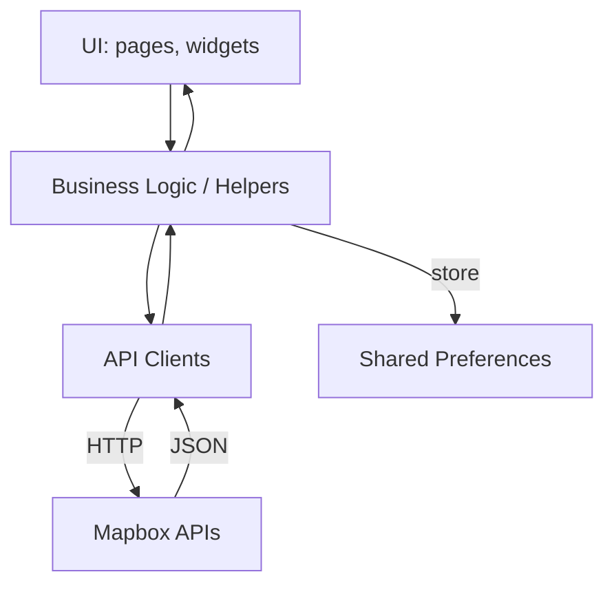

# 🗺️ flutter_mapbox_app

**Cross-platform Flutter application leveraging Mapbox APIs for map display, search, routing, and reverse geocoding.**

---

## 📌 Overview

`flutter_mapbox_app` is a Flutter-based project designed to work across **Android, iOS, Web, macOS, Linux, and Windows** platforms. The app integrates **Mapbox APIs** to deliver real-time **map rendering, location search, routing**, and **reverse-geocoding** capabilities. This project does **not** include a custom backend—the app interacts directly with **Mapbox’s external services**.

---

## 📁 File Structure

```
.
├── android/           # Android-specific runner and configs
├── ios/               # iOS-specific runner and configs
├── linux/             # Linux desktop runner
├── macos/             # macOS desktop runner
├── windows/           # Windows desktop runner
├── web/               # Web support files
├── assets/            # .env, fonts, and images
├── lib/
│   ├── pages/         # UI screens (Maps, Homepage, Search, etc.)
│   ├── widget/        # Reusable widgets (buttons, tab bars)
│   ├── helpers/       # Mapbox setup, shared preferences, utils
│   ├── requests/      # API clients (Directions, Search, Rev-Geocode)
│   └── main.dart      # App entry point
├── test/              # Widget tests
└── pubspec.yaml       # Dependencies and metadata
```

---

## 🧠 Architecture

### 📦 Platform Runners + Flutter Engine

Each platform folder (android/, ios/, etc.) provides native scaffolding to run the **shared Dart code** via the **Flutter engine**.

---

### 🧱 Application Layers

#### 1. **Presentation Layer** – UI Components

- `lib/pages/`: Screens like `MapScreen`, `SearchListView`, `OnMapDisplay`
- `lib/widget/`: Custom UI components (`ButtonWidget`, `TabbarWidget`)

#### 2. **Business Logic / State Management**

- `lib/helpers/mapbox_handler.dart`: Mapbox token and setup
- `lib/helpers/shared_prefs.dart`: Local settings management
- `lib/utils.dart`: Common functions

#### 3. **Service Layer – API Clients**

- `lib/requests/mapbox_directions.dart`: Route fetching
- `lib/requests/mapbox_search.dart`: Location search
- `lib/requests/mapbox_rev_geocoding.dart`: Reverse-geocoding

#### 4. **Data Layer**

- **Local**: Shared Preferences
- **Remote**: Mapbox REST APIs

---

## 🌐 External Services

- 🧭 **Mapbox Directions API**
- 🔍 **Mapbox Search API**
- 📍 **Mapbox Geocoding API**

---

## 🔁 Data Flow



- User interacts with UI → invokes logic  
- Logic makes API requests → receives response  
- Data is stored or used to update UI  

---

## 🧱 Design Principles

- **Layered Architecture**: Presentation → Logic → Services → Data  
- **Single Responsibility**: Each file has a well-defined purpose  
- **Dependency Inversion**: UI interacts with handlers/services, not raw APIs  

---

## 🛠️ Technologies Used

| Area              | Technology                |
|-------------------|---------------------------|
| Framework         | Flutter, Dart             |
| API Requests      | Dio                       |
| Maps Integration  | `flutter_map`, `mapbox_gl`|
| Local Storage     | Shared Preferences        |
| Config Management | `flutter_dotenv`          |

---

## 🖼️ System Design Diagram Guidelines

Use the following shape/color conventions when creating your diagram:

- 🟦 Blue: **Presentation Layer (pages, widgets)**
- 🟩 Green: **Business Logic / Helpers**
- 🟧 Orange: **Service Layer (API clients)**
- 🟨 Yellow Cylinder: **Data Store (Shared Preferences)**
- ⚪ Gray Cylinder: **External APIs (Mapbox)**
- ⚫ Light-Gray Parallelogram: **Platform Runners**

Group into swimlanes:
- **Flutter App**
- **Platform**
- **External Services**

---

## 📌 Final Notes

- Clearly reflect the role of every `lib/` subfolder.  
- Keep your diagram **layered and clean**—avoid unnecessary complexity.  
- Add a **legend** to explain your symbols and color scheme.

---

## 📄 License

MIT License – free to use with attribution.

- [Lab: Write your first Flutter app](https://docs.flutter.dev/get-started/codelab)
- [Cookbook: Useful Flutter samples](https://docs.flutter.dev/cookbook)

For help getting started with Flutter development, view the
[online documentation](https://docs.flutter.dev/), which offers tutorials,
samples, guidance on mobile development, and a full API reference.
